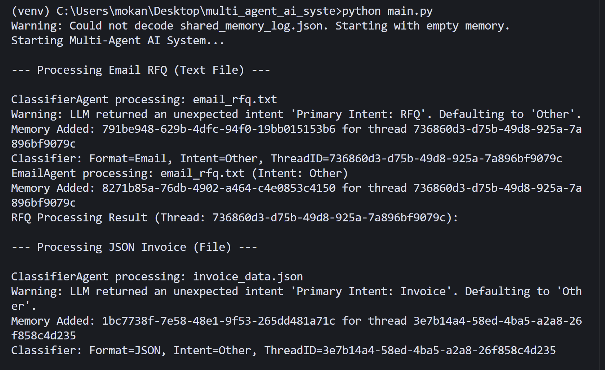
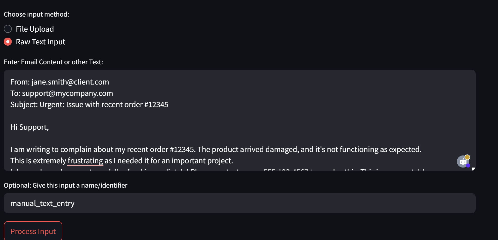
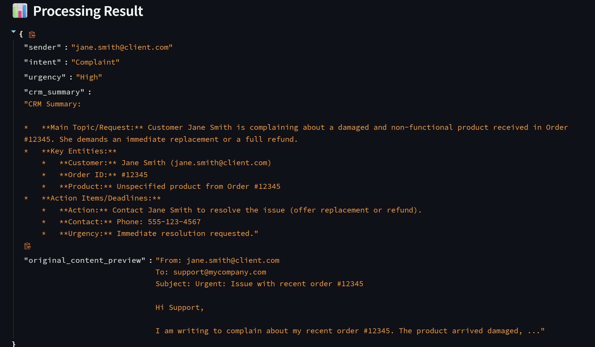
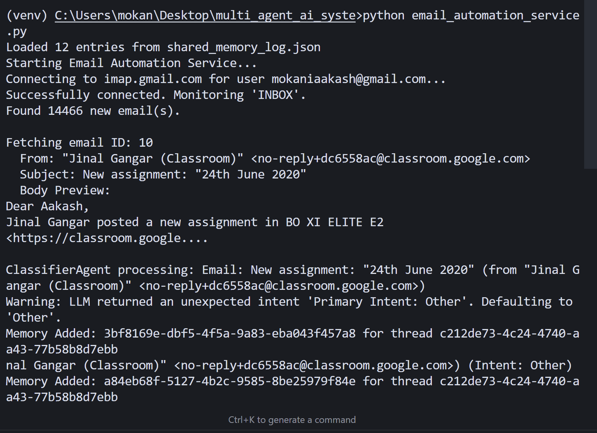

# 🤖 Multi-Agent AI System 

## 🚀 Three Operating Modes

> **The system can operate in three different modes:**
> - 💻 **Command-Line Interface (CLI)** - Direct script execution and testing
> - 🌐 **Web-based Streamlit Interface** - User-friendly dashboard with file uploads
> - 📧 **Automated Email Monitoring** - Real-time IMAP integration for incoming emails

---

## 🎥 System Demo

[](https://youtu.be/_QYir-ijlZA)

*Click the image above to watch a complete demonstration of the multi-agent AI system in action*

---
 
This project demonstrates a multi-agent AI system capable of processing inputs in PDF (simulated), JSON, or Email (text) format. It classifies the input format and intent, then routes it to an appropriate specialized agent. The system maintains a shared context for traceability and potential chaining of operations.

## 📸 System Screenshots

### 💻 Command Line Interface

*Command-line interface showing direct script execution and agent processing*

### 🌐 Web-based Streamlit Interface

*User-friendly web dashboard with file upload capabilities*


*Real-time processing results and shared memory visualization*

### 📧 Email Automation Service

*Automated email monitoring and classification system in action*
 
## 🏗️ System Overview 
 
*   **🎯 Classifier Agent:** 
    *   Receives raw input. 
    *   Detects format (PDF, JSON, Email/Text). 
    *   Uses Gemini LLM to determine intent (Invoice, RFQ, Complaint, Regulation, etc.). 
    *   Routes the input to the correct specialized agent. 
    *   Logs its findings to shared memory. 
*   **📊 JSON Agent:** 
    *   Accepts structured JSON payloads. 
    *   Validates against predefined schemas (can be extended). 
    *   Extracts/reformats data. 
    *   Flags anomalies or missing fields. 
*   **📧 Email Agent:** 
    *   Accepts email content (as text). 
    *   Uses Gemini LLM to extract sender, refine intent, assess urgency, and generate a CRM-style summary.
    *   Can automatically monitor incoming emails via IMAP and classify them in real-time.
*   **🧠 Shared Memory Module:** 
    *   A lightweight in-memory store (backed by a `shared_memory_log.json` file). 
    *   Stores: source identifier, source type, timestamp, classified format/intent, agent processed, extracted values, and a `thread_id` for conversation tracking. 
 
## 🛠️ Tech Stack 
 
*   🐍 Python 3.x 
*   🤖 Google Gemini (via `google-generativeai` library) for LLM tasks
*   🎨 Streamlit for web-based interface
*   📬 IMAP integration for automated email monitoring
*   📦 Standard Python libraries (`json`, `os`, `datetime`, `uuid`, `imaplib`, `email`). 
*   💾 In-memory dictionary with JSON file backup for shared memory. 
 
## 📁 Folder Structure 
```
multi_agent_ai_system/ 
├── agents/                    # Agent implementations 
├── memory/                    # Shared memory module 
├── utils/                     # Utility functions (e.g., LLM interaction) 
├── sample_inputs/             # Sample input files for testing 
├── public/                    # Screenshots and images
│   ├── 1.png                  # CLI interface screenshot
│   ├── 2.png                  # Streamlit dashboard screenshot
│   ├── 3.png                  # Streamlit processing view screenshot
│   └── 4.png                  # Email automation screenshot
├── .env                       # For API keys and email credentials (GITIGNORED) 
├── main.py                    # Main CLI script 
├── streamlit_app.py           # Streamlit web interface
├── email_monitor.py           # IMAP email monitoring script
├── requirements.txt           # Python dependencies 
├── shared_memory_log.json     # Log file for shared memory (GITIGNORED) 
└── README.md 
```
 
## ⚙️ Setup 
 
1.  **📥 Clone the repository:** 
    ```bash 
    git clone <your_repo_url> 
    cd multi_agent_ai_system 
    ``` 
 
2.  **🐍 Create a virtual environment (recommended):** 
    ```bash 
    python -m venv venv 
    source venv/bin/activate  # On Windows: venv\Scripts\activate 
    ``` 
 
3.  **📦 Install dependencies:** 
    ```bash 
    pip install -r requirements.txt 
    ``` 
 
4.  **🔑 Set up Environment Variables:** 
    *   Obtain an API key from [Google AI Studio](https://aistudio.google.com/app/apikey). 
    *   Create a file named `.env` in the root of the project (`multi_agent_ai_system/`). 
    *   Add your configuration to the `.env` file: 
        ```env 
        # 🤖 Google Gemini API Configuration
        GOOGLE_API_KEY="YOUR_GEMINI_API_KEY"
        
        # 📧 Email Monitoring Configuration (Optional - only needed for email automation)
        IMAP_SERVER="imap.gmail.com"  
        EMAIL_AUTOMATION_USER="your_email@gmail.com" 
        EMAIL_AUTOMATION_APP_PASSWORD="your_app_specific_password"
        ``` 
    *   **Important:** Ensure `.env` and `shared_memory_log.json` are added to your `.gitignore` file. 
      ``` 
      .env 
      shared_memory_log.json 
      venv/ 
      __pycache__/ 
      *.pyc 
      ```

5.  **📧 Email Setup (Optional - for automated monitoring):**
    *   For Gmail, you'll need to generate an App Password:
        1. ✅ Enable 2-Factor Authentication on your Google Account
        2. ⚙️ Go to Google Account settings → Security → App passwords
        3. 🔐 Generate a new app password for "Mail"
        4. 📝 Use this app password in the `.env` file (not your regular Gmail password)
 
## 🚀 How to Run

The system offers three different interfaces to suit various use cases:

### 1. 💻 Command Line Interface (CLI)

For direct script execution and testing:

```bash
python main.py
```

This runs the basic multi-agent system where you can input data directly through the command line interface.


### 2. 🌐 Streamlit Web Interface

For a user-friendly web-based interface:

```bash
streamlit run streamlit_app.py
```

This will start a local web server (typically at `http://localhost:8501`) where you can:
- 📤 Upload files (PDF, JSON, text)
- ✍️ Input text directly
- 👀 View processing results in real-time
- 📚 Browse shared memory logs
- 📊 Interactive dashboard for system monitoring


### 3. 📧 Automated Email Monitoring

For continuous email monitoring and automatic classification:

```bash
python email_monitor.py
```

This script will:
- 🔗 Connect to your email account via IMAP
- 👁️ Monitor incoming emails in real-time
- 🎯 Automatically classify and process each email
- 💾 Store results in shared memory
- 🔄 Run continuously until manually stopped (Ctrl+C)

**Note:** Email monitoring requires proper email credentials in the `.env` file.


## 💡 Usage Examples

### 💻 CLI Mode
```bash
# Run the main system
python main.py

# Follow the prompts to input data or file paths
```

### 🌐 Streamlit Mode
```bash
# Start the web interface
streamlit run streamlit_app.py

# Open browser to http://localhost:8501
# Use the web interface to upload files or input text
```

### 📧 Email Monitoring Mode
```bash
# Start automated email monitoring
python email_monitor.py

# The system will continuously monitor and process incoming emails
# Press Ctrl+C to stop monitoring
```

## ✨ Features

- 📋 **Multi-format Input Support:** PDF, JSON, and Email/Text processing
- 🧠 **Intelligent Classification:** AI-powered intent detection and routing
- 🎛️ **Multiple Interfaces:** CLI, Web UI, and automated email monitoring
- 💾 **Shared Memory:** Centralized logging and context management
- ⚡ **Real-time Processing:** Immediate classification and routing of inputs
- 🔧 **Extensible Architecture:** Easy to add new agents and input formats

## 🔒 Security Notes

- 🚫 Never commit your `.env` file to version control
- 🔐 Use app-specific passwords for email accounts, not your main password
- 🔄 Regularly rotate API keys and passwords
- 👀 Monitor shared memory logs for sensitive information before sharing